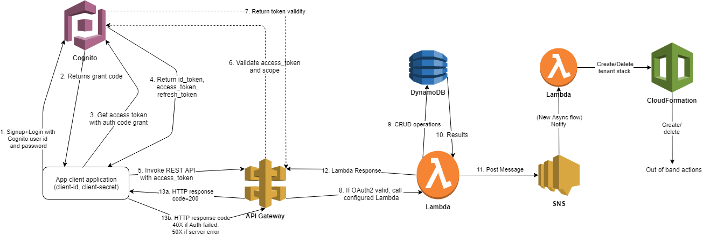

# Overview
This demonstrates the use of serverless technologies to perform a wide variety of operations on a hosted aplication in a secure way.

Specifically, setup up APIs with secure access using API-Gateway, Cognito and Lambda. 

# Workflow

# API
For this project we will create a REST API and implement CRUD operations on a resource. For the purpose of this project, the resource is a customer whom we want to on-board for a large web-application. For every customer we on-board a dedicated set of AWS resources are also provisioned dedicated for that customer. We will call this resource tenant. Most common enterprise SaaS solutions require this use case.

# Implemtation
Multiple AWS services are used here using a wide variety of languages and deployment approaches. In a real project, you will probably use a single programming language, a single deployment process, etc. This is a demo project and made to be used as a reference.

- Cognito : This service is used for creating users, defining resource servers, apps and an OAuth2 domain.

- API Gateway : REST APIs are implemented here. Authorization will be based on Cognito user pool, so that only authorized users and clients are able to access the resources.

- Lambda : API calls will be redirected to Lambda functions 

- Dynamodb : A non-SQL db for storing state of REST API resources

- S3 : For storing anything that is a blob related to the resource.

- IAM : To define roles for the the usage of the AWS resources.

- SNS : To trigger back end functions for asynchronous processing.

- CloudFormation : Deploy additional AWS resources as required by the APIs.

# 